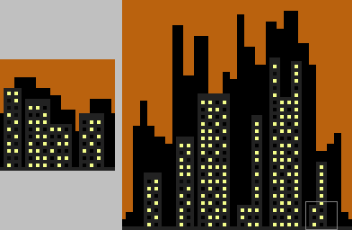

# libwfc

libwfc is a single-header C library for the Wave Function Collapse algorithm (WFC). It (currently) only covers the 2D overlapping model. WFC accepts a small reference image and outputs a larger image that resembles the input. See https://github.com/mxgmn/WaveFunctionCollapse for more details on the algorithm.

This project also offers a CLI and a rudimentary GUI tool for the WFC process.


Quite a bit of effort has gone into making this library fast. See `benchmark/` for some benchmark results.


I also kept a devlog while working on this project - you can [find it here](https://www.vplesko.com/posts/wfc/devlog_0.html) if you're curious.

## How to use the library

You only need `wfc.h`. Include it like this:

```c
    #define WFC_IMPLEMENTATION
    #include "wfc.h"
```

Call `wfc_generate`:

```c
    wfc_generate(
        // pattern width and height, 3 is a good starting value
        n,
        // options to control WFC, 0 if you don't want to enable any
        wfc_optFlipH | wfc_optRotate | wfc_optEdgeFixV,
        // byte size of a single pixel value
        4,
        // dimensions and bytes of the input image
        srcW, srcH, (unsigned char*)src,
        // dimensions and bytes of the output image
        dstW, dstH, (unsigned char*)dst);
```

There are other functions and ways of running WFC, check out the giant comment near the start of `wfc.h` for instructions.

If you want to test the correctness of the library on your system, run `make test`.

### Zig

To get the library up and running in a Zig project is quite simple.
This version has been tested using Zig 0.13.0.

In your terminal:

```
zig fetch --save=wfc https://github.com/QuentinTessier/libwfc/archive/${COMMIT_HASH}.tar.gz
```

In `build.zig`:
```zig
    const wfc_dep = b.dependency("wfc", .{});
    const wfc = wfc_dep.module("wfc");
    exe.root_module.addImport("wfc", module);
```

In your source:
```zig

    const wfc = @import("wfc");

    pub fn main() anyerror!void {
        var gpa = std.heap.GeneralPurposeAllocator(.{}){};
        defer _ = gpa.deinit();

        const allocator = gpa.allocator();

        var prng = std.rand.DefaultPrng.init(blk: {
            var seed: u64 = undefined;
            try std.posix.getrandom(std.mem.asBytes(&seed));
            break :blk seed;
        });
        const rng = prng.random();

        _ = wfc.init(allocator, rng);
        defer wfc.deinit();

        var state = wfc.State.init(
            // pattern width and height, 3 is a good starting value
            n,
            // options to control WFC, .{} if you don't want to enable any. Uses zig's packed struct to represent bitfields
            .{ .optFlipH = true, .optRotate = true, .optEdgeFixV = true },
            // byte size of a single pixel value
            4,
            // dimensions and bytes of the input image
            srcW, srcH, (unsigned char*)src,
            // dimensions of the output image
            dstW, dstH,
            null,
        );
        defer state.deinit();
    }

```

## How to use CLI and GUI tools

### Building

Run `make` to build both tools. Alternatively, `make cli` and `make gui` build individual tools.

To build and run the GUI, you'll need to have SDL2 installed on your system. You'll also need to have the `sdl2-config` program available.

#### Note for Windows

If you are on Windows, the process is slightly more complicated.

Installing SDL2 means downloading the files and dropping them in a directory (eg. `C:\SDL2`) and then adding that directory to your PATH system variable. You'll need both the DLLs and development files.

Since `sdl2-config` is not provided for Windows, I've written my own hacky version of it - check out `misc/sdl2-config`.

Whenever you're running make, add `WIN=1` to the command. If you are using Microsoft's linker (and not, say, MinGW), also add `VC=1`. For example, `make cli` becomes `make WIN=1 VC=1 cli`.

### Running

Run the CLI with:

```
bin/cli external/samples/Angular.png -n 3 -w 64 -h 64 -o bin/gen.png
```

And the GUI with:

```
bin/gui external/samples/Angular.png -n 3 -w 64 -h 64 -o bin/gen.png
```

Simply run `bin/cli` or `bin/gui` to see the list of possible arguments.

The library itself does not deal with file I/O nor with backtracking in case WFC runs into a contradiction. CLI and GUI both do.

GUI lets you watch WFC as it runs and you can pause/unpause it. You can also erase parts of the generated image and force WFC to generate them anew.



## Contributing

For the time being, this is a single-person project, so please do not send any pull requests.

If you find bugs or have suggestions, create an issue to let me know.

## Credits

Sample images were taken from https://github.com/mxgmn/WaveFunctionCollapse. See https://github.com/mxgmn/WaveFunctionCollapse#credits for more detailed attributions.

`stb_image.h` and `stb_image_write.h` come from https://github.com/nothings/stb.